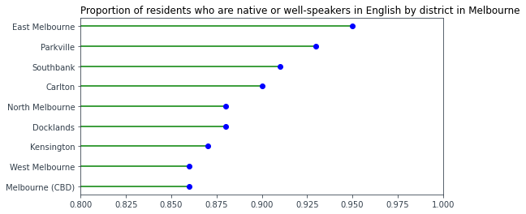

# Introduction
This section aims to include the demographic aspect into the analysis so far conducted. For this purpose, we used the [Residents Profiles by CLUE Small Area](https://data.melbourne.vic.gov.au/People/Residents-Profiles-by-CLUE-Small-Area/d34a-re98) data set, it contains the demographic profile information for City of Melbourne residents from the ABS 2011 and 2016 Census of Population and Housing. Data are aggregated by City of Melbourne small areas.

The perspective adopted in this analysis will consider, in particular, **income**, __education__ and **language spoken**. Those three specific topics have been selected for their relevance as considered also in this study [1].

Before diving into the analysis according to the different demographic aspects, it is interesting to recall the first visualization from the [Tree presentation](https://mariapiamacedo.github.io/testsite.github.io/PAGE1.html) section and see the differences or similarities in the amount of trees planted in the several Melbourne areas. \
The period from 2003 until only 2016 has been considered for the sake of consistency, since the data used comes from the census of that year. Doing so, correspondences between this feature and demographic factors can be investigated.

<iframe src="/testsite.github.io/Planted_geoheatmap.html"
	sandbox="allow-same-origin allow-scripts"
	width="100%"
	height="500"
	scrolling="no"
	seamless="seamless"
	frameborder="2">
</iframe>

A higher number of trees are planted over the years in _Parkville_ and *Kensington* compared to the other areas. Demographical factors as well as geographical play a role in influencing that outcome. Nevertheless, only the former are explored in this project.

# Income
The different areas are now compared concerning their residents' median income. A straightforward visualization of the result of this comparison is provided by the horizontal bar chart below. Furthermore, a choropleth map makes possible to classify the different areas according to the median income.

	

<iframe src="/testsite.github.io/Income_geomap.html"
	sandbox="allow-same-origin allow-scripts"
	width="100%"
	height="500"
	scrolling="no"
	seamless="seamless"
	frameborder="2">
</iframe>

By looking at the total area considered, the richer areas seems to be on the west and south sides, and are *Kensington*, _Docklands_ and *Southbank*, a part from _East Melbourne_ that is the reachest by far.

# Education
Concerning education, the results are presented in the same way as they were for income. More specifically, with education has been considered the education level of the residents, namely it has been considered the proportion of population that owns a degree to compare the different areas.

	

As can be seen in the horizontal bar chart above, there is less discrepancy among the areas, mostly due to the fact that a proportion is considered in this case instead of an absolute value. \
The more educated is _East Melbourne_, followed by *Kensington* and _Carlton_. Whereas, the least educated is West Melbourne.

<iframe src="/testsite.github.io/Education_geomap.html"
	sandbox="allow-same-origin allow-scripts"
	width="100%"
	height="500"
	scrolling="no"
	seamless="seamless"
	frameborder="2">
</iframe>

The more educated areas are this time in the Northern part, and few of them are the same that fall among the richest income-wise, i.e. _Kensington_ and *East Melbourne*.

# Language spoken
Finally, the last factor is measured by the goodness of language spoken, in particular, the level of spoken English is the comparison factor. People who are native speakers as well as very-well or well speakers, as stated in the census, are taken into account in the proportion, over the total number of residents. 

	

_East Melbourne_ has the highest score again, and it can be argued that is not an unusual result because income, level of education and level of spoken English are somehow demographically connected by the mutual influence they can have on each other. \
Nevertheless, the other areas look more shuffled respect to the previous rankings.

<iframe src="/testsite.github.io/Ethnicity_geomap.html"
	sandbox="allow-same-origin allow-scripts"
	width="100%"
	height="500"
	scrolling="no"
	seamless="seamless"
	frameborder="2">
</iframe>

As shown by also the choropleth map above, best speakers are not all living in a single part of the city. \
It is also worth to mention that the scores of the different areas are quite close to each other. That is because still a proportion has been considered, but also Melbourne is an English-speaking city. Therefore, the fairly big difference in the lengths of the bar chart and in the colors of the maps should serve as a help for the viewer but not be misleading.

### References
1. _Caragh G. Threlfall, Lucy Dubrelle Gunn, Melanie Davern, Dave Kendal, "Beyond the luxury effect: Individual and structural drivers lead to ‘urban
forest inequity’ in public street trees in Melbourne, Australia", 19 November 2021, Landscape and Urban Planning journal_

[back](./)
