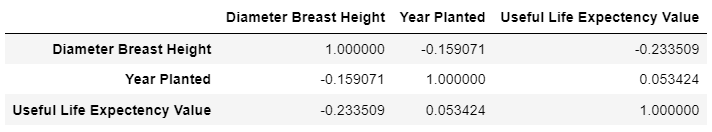

# Motivation

It would be very useful for cities' green departments to access the remaining life expectancy of the existing trees. Knowing this information would play an important role in urban forest planning and sustainability reporting.

# The model

Therefore, we created a model that predicts the 'Useful time expectancy' of a tree based on some its characteristics such as 
* Name, Genus and Family,
* Diameter of the breast height, 
* The year it was planted and its Age description',
* Weather it is located on a street or a park.

The numerical data features correlation with the target variable **Useful Life Expectancy** is shown in the table below.

	

It is immediately evident that the feature influencing the target the most is the diameter of the breast height. Its negative correlation can be interpreted as _the bigger the diameter, the older the tree, and therefore smaller is its life expectancy_.

Nonetheless, to fit the model with all the features, the categorical data had to be parsed into binary and therefore many new features were created. The 5 more positively correlated with the target can be seen in the first graph below in orange and the 5 more negatively correlated in the second one in green.

	

	

After reducing the features dimensionality to a total number of 9 (Explaining 99% of the entire data)

	

# Limitations

1. The model can't be easily escalated to other cities as it was trained mostly with Australian native trees species.
1. xx
1. 

[back](./)
