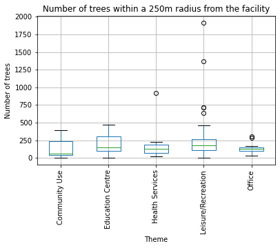

# Tree impact

## Impact on temperature
To examine the impact of trees on the temperature, we add two datasets to the analysis. The first contains the locations of microclimate sensors in Melbourne and the second one contains the actual readings these sensors made. The second dataset contains a lot of different variables, but for our analysis we only use the temperature. 

<iframe src="/socialdata/sensor-locations.html"
	sandbox="allow-same-origin allow-scripts"
	width="100%"
	height="500"
	scrolling="no"
	seamless="seamless"
	frameborder="0">
</iframe>

This map shows the locations of the different sensors in Melbourne. The sensors are spread quite well throughout the inner city. There is one location that has multiple sensors close to each other, which are the sensors close to the Convention Centre by the Docklands (1007, 1010 and 1011).

These line charts show the temperature for the different sensors in Melbourne. From these charts we can conclude that some sensors have been put into use later than some other sensors, as well as that sensor 1015 and 1016 have not recorded temperatures for a period of respectively 2 months and 1 month. That is not a problem for our research about the influence of trees on the temperature, because we will look at September 2021, because that is the last month that the tree data got updated. For the three sensors that were located closely to each other, we will use the data from sensor 1007 and not 1010 and 1011, because the data from sensor 1007 is more complete.

<iframe src="/socialdata/tree-temperature.html"
	sandbox="allow-same-origin allow-scripts"
	width="100%"
	height="500"
	scrolling="no"
	seamless="seamless"
	frameborder="0">
</iframe>

This map shows the temperature measured by different sensors in Melbourne. The size of the circle shows the number of trees in a 250 meter radius around the sensor. The expectation was that the measured temperature would be lower for sensors that are surrounded by more trees ([source](https://www.epa.gov/heatislands/using-trees-and-vegetation-reduce-heat-islands)). However, the highest temperature recorded was for a sensor with the highest number of trees whereas the lowest temperature of 14.57 degrees is measured by a sensor that is surrounded by an average number of trees. What stands out about this location is that it is located by the Docklands, which means it is by the water. An explanation for the lower temperature in this area is that the water coming from the ocean has a cooling effect ([source](https://floridakeys.noaa.gov/ocean/weather.html)). 

To further investigate the relationships between trees and temperature we made a linear regression model. For this linear regression model we added the variable 'Time' which is the time of the day and the variable 'Count', which is the number of trees in a 250m radius from the sensor.

The linear regression model has a high R2-score of 0.83, which means the model is good at predicting the temperature in Melbourne when given the time of the day and the number of trees surrounding the sensor. However, the lolipop plot shows that the number of trees has a very low influence on the temperature, which we already suspected from the map we made before. To make a better analysis of the influence of the trees, more data has to be available with historic tree numbers in Melbourne, so the analysis can be done on more than just one day. On top of that, there could be other environmental factors that influence the temperature, for example the presence of water by the sensor. 

## Impact on anxiety and stress

Trees have a positive influence on anxiety and stress levels of people ([source](https://www.weforum.org/agenda/2021/04/city-trees-reduce-stress-and-anxiety/)). Therefore we are examining the presence of trees around certain facilities in Melbourne. To do this we add an extra dataset to the analysis. This dataset contains the locations of facilities in Melbourne, and a few extra variables: theme, sub theme and feature name. For our analysis we focus on facilities that can be categorized into one of the following themes:

* Health Services: hospitals and medical centres
* Education Centre: primary schools, secondary schools and universities
* Office: offices
* Leisure/Recreation: parks, sport locations and indoor and outdoor recreational facilities
* Community Use: police and fire stations, cemeteries, government buildings and visitor centres

The goal of the analysis is to find out if there are more trees around locations that can be considered stressful, like hospitals ([source](https://www.researchgate.net/publication/215477754_How_do_patients_experience_stress_caused_by_hospitalization_and_how_do_nurses_perceive_this_stress_experienced_by_patients_A_comparative_study)), schools ([source](https://www.npr.org/sections/health-shots/2013/12/02/246599742/school-stress-takes-a-toll-on-health-teens-and-parents-say?t=1652184699945)), police stations and offices ([source](https://www.cnbc.com/2021/08/03/1-in-3-people-say-return-to-office-negatively-impacted-mental-health.html)) compared to recreational facilities. 

The boxplot shows that there are no big differences in the number of trees surrounding different types of facilities. Around leisure and recreation facilities there seem to be a little bit more trees than around the other facility types. In order to reduce stress and anxiety amongst citizens in Melbourne it could be a good idea for the city to focus on planting more trees around the other facility types, because those facility types are already stressful places. Because of the stress-reducing effect of trees, it would be good to have more trees around those facilities.
