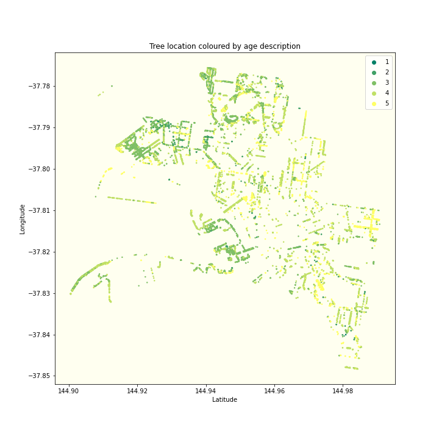
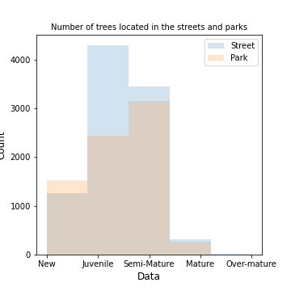
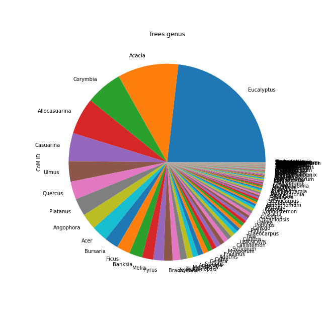

# Introduction

Trees play a decisive role for both the population and the planet. 
It has been demonstrated in various studies that the presence of trees and nature in the cities can improve the community's mental health, youngster's attention span, and therefore their test scores, and beyond.

Cities must consider trees in their plans to reach sustainability goals. Trees cool our urban centers and provide benefits that can lead cities to tackle 15 out of 17 SDG - Sustainable development goals - globally supported by the United Nations.

In this project, we will explore Melbourne city's urban forest, and try to take some conclusions on how it influences or is influenced by demographic aspects.

***

The City of Melbourne currently maintains more than 70,000 trees planted all around the urban space, however, we only have cleaned, and accurate data for nearly 54,000, and therefore only this number of trees will be considered over the entire analysis. 

Since 2003, due to the 'Melbourne's Urban Forest project, different types of trees were planted slowly covering the city with green areas as we can see in the video below.

<iframe src="/testsite.github.io/tree-coverage-cumsum.html"
	sandbox="allow-same-origin allow-scripts"
	width="100%"
	height="500"
	scrolling="no"
	seamless="seamless"
	frameborder="2">
</iframe>

In the following visualization, one can get a perspective of where are the more mature trees planted, as well as the newest ones. The darker the dots are, the more mature a tree is. When compared with the video above, it can be seen that the most developed trees are located in the oldest part of the city (left side) that nowadays are not more densely populated by trees than other surrounding areas.

69% of the trees are planted in the streets and the remaining 31% in parks. This is quite interesting if one notices that parks account for nearly 0.05% of the city's total area. So even though more trees are planted in the street (considering absolute values), the same amount survived until maturity in both locations. This implies that Parks are in fact a better environment for tree development.

***
Diversification is a key approach to reducing risk. Combining different species makes the forest more resilient and more stable in the long term.
Not doing it weakens the urban forest's capability of fighting pests, disease, and stress due to climate change.

* **Eucalyptus** are Austrailian native trees, fast growing sources of wood and oil producers that can be used for cleaning and as a natural insecticides.

* **Acacias** are native to Australia and Africa and easily grow in warm climates. Most types are fast growers but usualy dont live more than 20-30years.

* **Allocasuarina** is endemic to Australia. Tipical of nutrient-impoverished soils

* **Corymbia** is referred to as eucalypts. Until 1990, corymbias were included in the genus Eucalyptus and there is still considerable disagreement among botanists as to whether separating them is valid. As of January 2020, Corymbia is an accepted name at the Australian Plant Census.

* **Casuarina** native to Australia. fast growing with wide-ranging adaptability to differnet environmnets.

[back](./)
