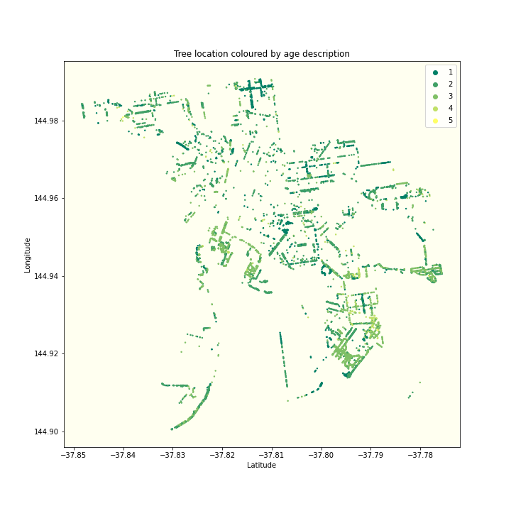

# Introduction

Trees play a decisive role for both the population and the planet. 
It has been demonstrated in various studies that the presence of trees and nature in the cities can improve the community's mental health, youngster's attention span, and therefore their test scores, and beyond.

Cities must consider trees in their plans to reach sustainability goals. Trees cool our urban centers and provide benefits that can lead cities to tackle 15 out of 17 SDG - Sustainable development goals - globally supported by the United Nations.

In this project, we will explore Melbourne city's urban forest, and try to take some conclusions on how it influences or is influenced by demographic aspects.

<iframe src="/testsite.github.io/tree-coverage-cumsum.html"
	sandbox="allow-same-origin allow-scripts"
	width="100%"
	height="250"
	scrolling="no"
	seamless="seamless"
	frameborder="0">
</iframe>

blablabla

[back](./)
