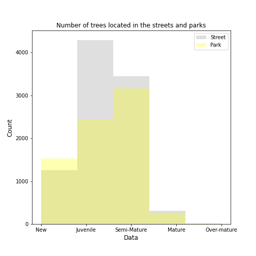
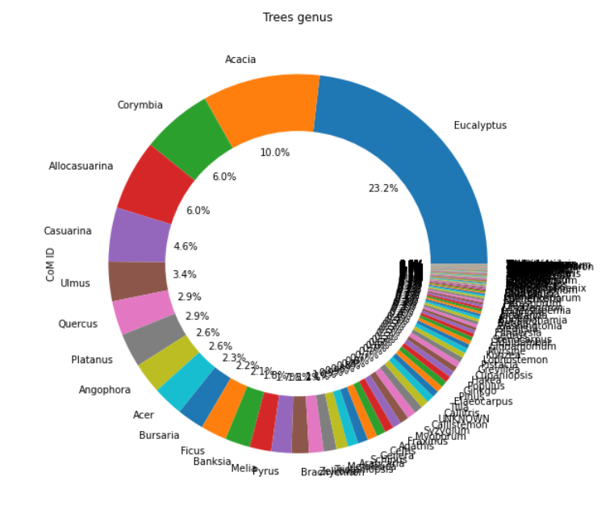

# Introduction

Trees play a decisive role for both the population and the planet. 
It has been demonstrated in various [studies](https://nph.onlinelibrary.wiley.com/doi/epdf/10.1002/ppp3.39) that the presence of trees and nature in the cities can improve the community's mental health, youngster's attention span, and therefore their test scores, and beyond.

Cities must consider trees in their plans to reach sustainability goals. Trees cool our urban centers and provide benefits that can lead cities to tackle 15 out of 17 SDG - Sustainable development goals - globally supported by the United Nations.

In this section, we will explore _Melbourne city's urban forest_, and try to take some conclusions on how it influences or is influenced by demographic aspects.

***

## Trees location and its influence over maturity 

The City of Melbourne currently maintains more than 70,000 trees planted all around the urban space, however, we only have cleaned, and accurate data for nearly 54,000, and therefore only this number of trees will be considered over the entire analysis. 

Since 2003, due to the 'Melbourne's Urban Forest project, different types of trees were planted slowly covering the city with green areas as we can see in the video below.

<iframe src="/testsite.github.io/tree-coverage-cumsum.html"
	sandbox="allow-same-origin allow-scripts"
	width="100%"
	height="500"
	scrolling="no"
	seamless="seamless"
	frameborder="2">
</iframe>

In the following visualization, one can get a perspective of where are the more mature trees planted, as well as the newest ones. The darker the dot, the more mature a tree is. When compared with the video above, it can be seen that the most developed trees are located in the oldest part of the city (left side) that nowadays is not more densely populated by trees than other surrounding areas.

	

56% of the trees are planted in the streets and the remaining 44% in parks. This is quite interesting if one notices that parks account for nearly 0.05% of the city's total area. So even though more trees are planted in the street (considering absolute values), the same amount survived until maturity in both locations as it can be seen in the histogram bellow. This implies that Parks are in fact a better environment for tree development.

	

If we take a closer look at how many trees were planted per year since 2003, it is clear that 2013 stands out quite notorious comparing with the other years.  This can be explained by the approval of the 'Urban forest' strategy in 2012 that sat a bold target of doblind the canopy within less than 30 years ([font](https://heritagecouncil.vic.gov.au/wp-content/uploads/2014/09/ROYAL-PARK-ED-Rec-Feb-2014.pdf)). Furthermore, by that time many of Melbourne's trees were reaching the end of their natural life span which created an immediate urgency of replanting.  

	

The great majority of these trees were planted in the Royal Park which doesn't come as a big surprise after our first conclusion about trees reaching a higher maturity when located in parks. This, together with the fact that the royal park is an old green space within the city with a higher chance of having kept old trees until that date. These trees were most likely reaching their end of life and were therefore replanted that same year after the strategy approval.

	

Bellow it can find an overview of the 10 most planted families of trees in that year (2013). The red dashed line is a threshold of 200 trees planted that provides a better understanding when comparing the different families. 3 out of the 34 existing families of trees alone - Myrtaceae, Fabaceae, and Casuarinaceae - account for 81% of the total amount of trees planted in 2013.

	

***

## Trees Diversification

Diversification is a key approach to reducing risk. Combining different species makes the forest more resilient and more stable in the long term.
Not doing so, weakens the urban forest's capability of fighting pests, disease, and stress due to climate change.

	

	

1. **Eucalyptus** are Austrailian native trees, fast growing sources of wood and oil producers that can be used for cleaning and as a natural insecticides.

1. **Acacias** are native to Australia and Africa and easily grow in warm climates. Most types are fast growers but usualy dont live more than 20-30years.

1. **Corymbia** is referred to as eucalypts. Until 1990, corymbias were included in the genus Eucalyptus and there is still considerable disagreement among botanists as to whether separating them is valid. As of January 2020, Corymbia is an accepted name at the Australian Plant Census.

1. **Allocasuarina** is endemic to Australia. Tipical of nutrient-impoverished soils.

1. **Casuarina** native to Australia. fast growing with wide-ranging adaptability to differnet environmnets.

[back](./)
